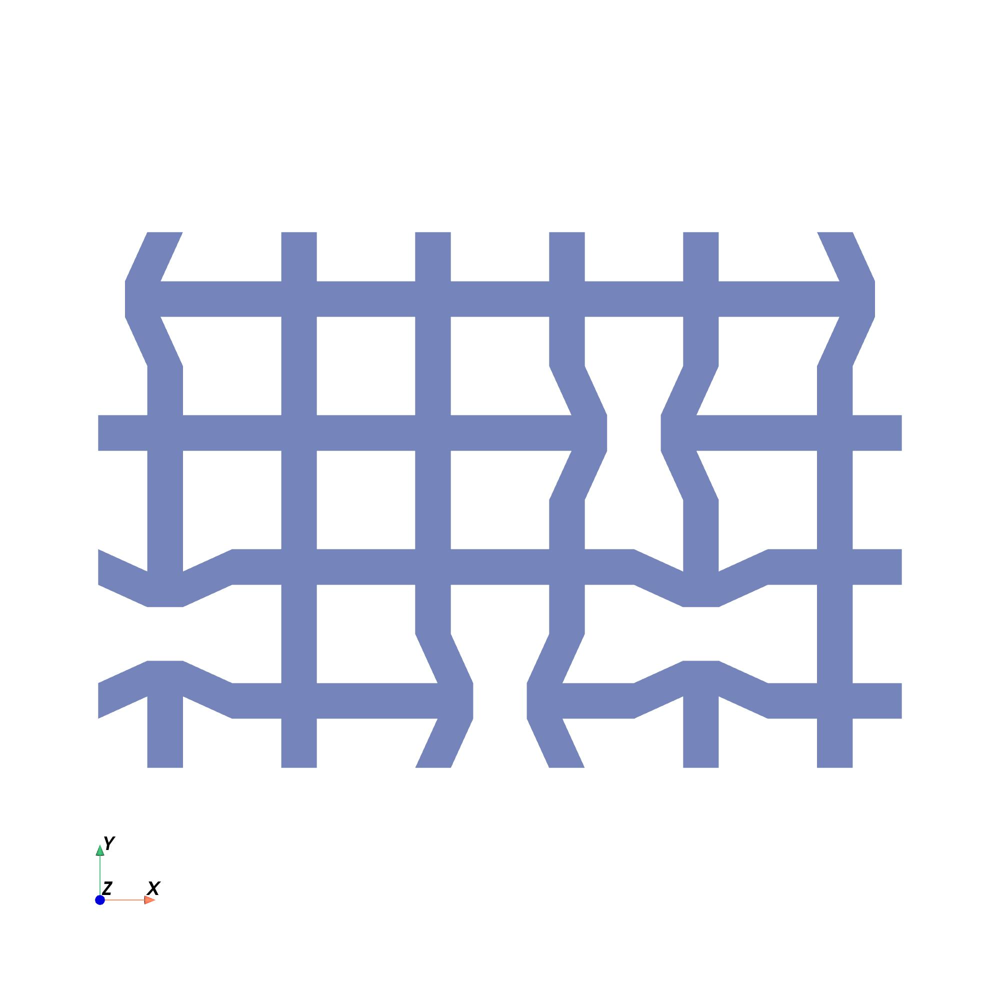
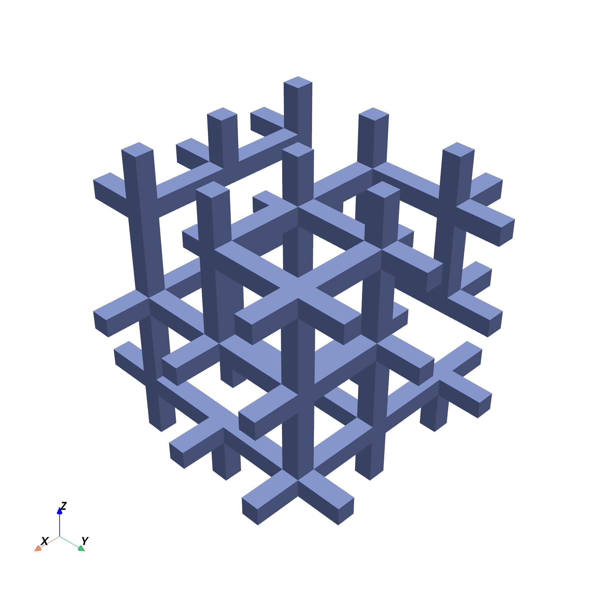
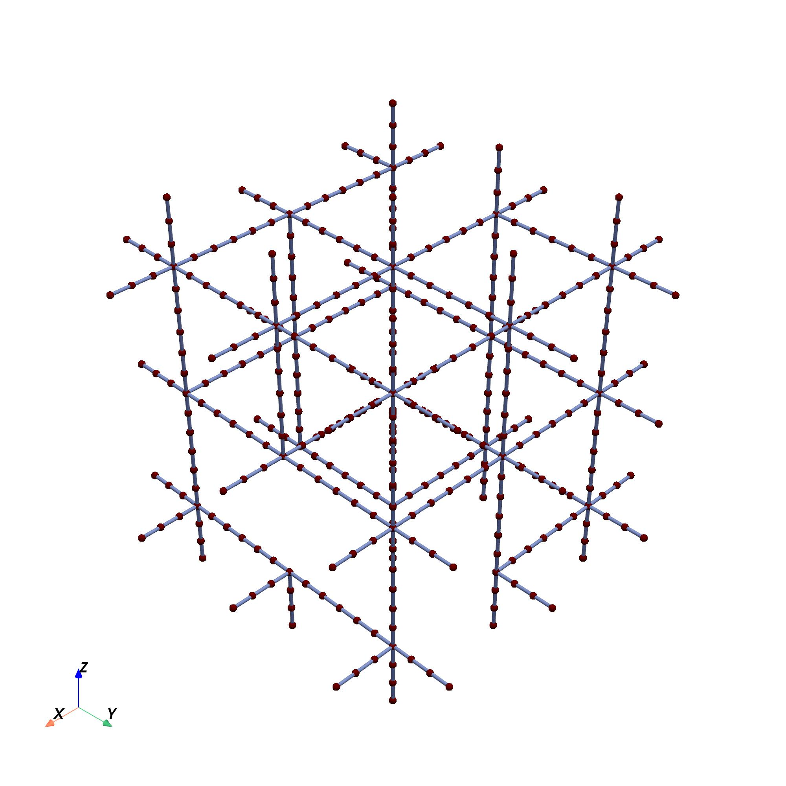

# Heterogeneous Virtual Growth Algorithm

This program generates patterns with seamlessly connected building blocks. 

The program generalizes the [virtual growth scheme](https://www.science.org/doi/full/10.1126/science.abn1459) to account for 
spatially varying frequency hints. It also converts the generated patterns to
FEA meshes and evaluate their [homogenized elasticity matrices](https://www.sciencedirect.com/science/article/pii/S0045782512000941).

## Examples

2D pattern



3D pattern



2D FEA mesh (Q4 elements)


3D FEA mesh (frame elements)



## How to use this program

### Installation
To download the code, run the following command in your terminal:
```
git clone https://github.com/jiayingqi/Heterogeneous-Virtual-Growth
```

Then run the following command to install xvfb for visualization:
```
apt-get -qq update && apt-get -y install libgl1-mesa-dev xvfb
```

Finally, run the following command to install the required Python packages:
```
pip3 install -r requirements.txt
```

### Start with the program
Generate the adjacency rules:
```
python3 scripts/generate_rules_script.py
```

Generate the patterns:
```
python3 scripts/virtual_growth_script.py
```

Convert the patterns to FEA meshes:
```
python3 scripts/generate_mesh_script.py
```

Evaluate the homogenized elasticity matrices:
```
python3 scripts/homogenize_script.py
```

## Authors, sponsors, and citation

### Authors
- Yingqi Jia (yingqij2@illinois.edu)
- Ke Liu (liuke@pku.edu.cn)
- Xiaojia Shelly Zhang (zhangxs@illinois.edu)

### Sponsors
- U.S. National Science Foundation (NSF) EAGER Award CMMI-2127134
- U.S. NSF CAREER Award CMMI-2047692
- U.S. NSF Award CMMI-2245251
- U.S. Air Force Office of Scientific Research (AFOSR YIP, FA9550-23-1-0297)
- National Natural Science Foundation of China (Grant 12372159)

### Citation
- To be added
